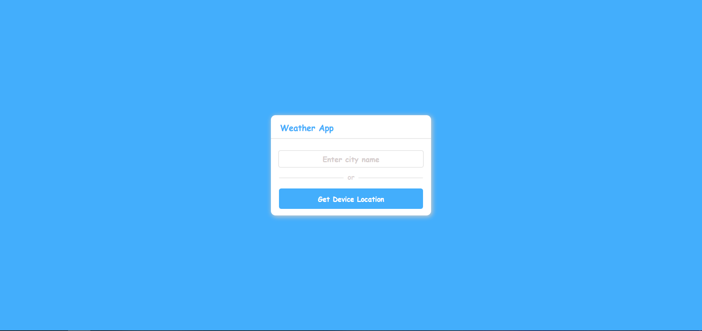
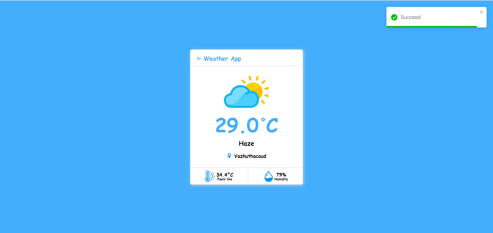

# Weather App with OpenWeatherMap
# React + Vite

A simple weather app built with the OpenWeatherMap API, and React + Vite.js focused on the UI, and UX, displaying important data in a neat format, also handled successfull and failed api calls with toastify, icons used from react-icons package. and using geolocation to obtain the current location of the device.

Currently, two official plugins are available:

- [@vitejs/plugin-react](https://github.com/vitejs/vite-plugin-react/blob/main/packages/plugin-react/README.md) uses [Babel](https://babeljs.io/) for Fast Refresh
- [@vitejs/plugin-react-swc](https://github.com/vitejs/vite-plugin-react-swc) uses [SWC](https://swc.rs/) for Fast Refresh
